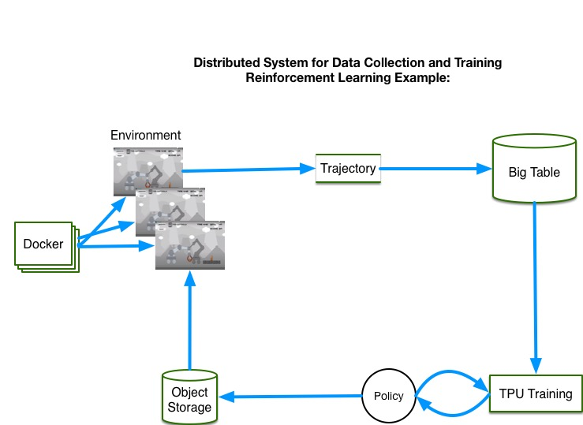
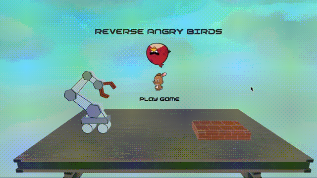

### A distributed system for Reinforcement Learning / Training

Support for multiple environments which produces a Trajectory into a replaybuffer.  
The base model is a DQN.  
Environments and Policy are stored in object storage , while the replaybuffer is on bigtable.  
While DQN is an on-policy algorithm, in a distributed environment the collection policy is sometimes out of date compared to the training policy. In that case we are training off policy.  

The code provided requires certain configuration / resources in order to work:  
*We used Google Cloud Platform, but it may be possible to use a different service*  
-A cloud service with:  
  -object storage (GCP glob)  
  -query based database (bigtable)  
  -Docker orchestration (Kubernetes)  
  -TPU / GPU allocation  
-Service Authentication (eg; Application level credentials)  
-An Environment which outputs (State Observations, Available Actions, previous_state_Reward)  
-The code for our training and collections is opening source but the environment built on Unity is not.  
  -We have included 2 open source environments /cartpole and /breakout to test.  

##Deployment :
 With Docker Orchestration Deploy :
 https://github.com/jun-bun/rab-tf-agents/blob/master/deploy/Dockerfile
 *Note we use a specific docker build which supports Unity on Linux the base container is hosted here : https://hub.docker.com/r/tenserflow/gpu-unity-ubuntu-xfce-novnc*

